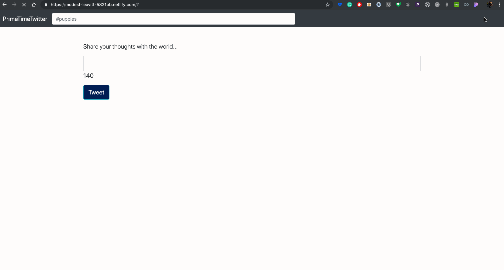

# CoderSchool FTW -  PrimeTimeTwitter

Created with love by: Loi Tran
  
An application which has tweets, retweets, liking, signin, and delete functionlity using basic HTML, CSS, & ES6.

## Try it out

Demo online at [this link.](https://modest-leavitt-5821bb.netlify.com/)

## Video Walkthrough



## State

The following is an object which represents our application's `state`. Understanding how to work with this object is critical to how the application behaves.

```javascript
{
  "tweets": [
    {
      "body": "Practice on many types of different applications",
      "likes": [
        "PrimeTimeTran",
        "Phil"
      ],
      "retweets": [
        {
          "body": "Sounds like a good idea to me!",
          "likes": [],
          "createdAt": "2019-05-26T06:32:25.172Z",
          "userName": "Chung2klee"
        }
      ],
      "createdAt": "2019-05-26T05:13:17.363Z",
      "userName": "BoomBoomRay"
    },
    {
      "body": "Study hard to learn programming.",
      "likes": [
        "BoomBoomRay",
        "PrimeTimeTran",
        "Hieu"
      ],
      "retweets": [],
      "createdAt": "2019-05-26T05:13:11.748Z",
      "userName": "BoomBoomRay"
    }
  ],
  "currentUser": "BoomBoomRay"
}
```

## User Stories

The following **functionalities** are completed:

* [x] User can sign in.
* [x] User can sign out.
* [x] User can make a new tweet.
* [x] User is prompted to make a tweet using a custom prompt message which uses their name.
* [x] User is prompted on how many characters their tweet is.
* [x] User cannot make a tweet over 140 characters.
* [x] User will see black text is tweet is under 140 characters.
* [x] User will see a red text prompt if the tweet is 140 characters.
* [x] User can see list of tweets.
* [x] User can delete tweet if they are the one that made it.
* [x] User can see who tweet was made by.
* [x] User can see when a tweet was made.
* [x] User can like tweet.
* [x] User can unlike tweet.
* [x] User can respond to a tweet by 'retweeting' 
* [x] User can have tweet data saved(closing tab does not 'restart' application).
* [x] User can see total number of tweets.
* [x] User can see total number of likes.
* [x] User can see total number of retweets.

## Time Spent and Lessons Learned

Time spent: **4** hours spent in total.

I learned how to implement a 'react-like' structure for the application using JS. After a few refactors the code ended up a lot cleaner. I also learned how forms work in bootstrap better. If properly setup they can fire actions on enter press without an event listener.

## License

    Copyright [2019] [Loi Tran]

    Licensed under the Apache License, Version 2.0 (the "License");
    you may not use this file except in compliance with the License.
    You may obtain a copy of the License at

        http://www.apache.org/licenses/LICENSE-2.0

    Unless required by applicable law or agreed to in writing, software
    distributed under the License is distributed on an "AS IS" BASIS,
    WITHOUT WARRANTIES OR CONDITIONS OF ANY KIND, either express or implied.
    See the License for the specific language governing permissions and
    limitations under the License.